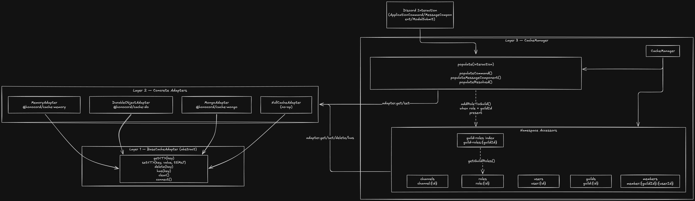

import { Tabs, TabItem, Aside } from "@astrojs/starlight/components";

Honocord uses a modular caching system that allows you to easily integrate different caching backends, such as in-memory, Durable Objects, MongoDB, or your own custom implementation.
This guide will walk you through the basics of Honocord's caching system, how to set it up, and best practices for using it in your implementation.

## Cache Adapters

Honocord provides several built-in cache adapters:

- [`MemoryCacheAdapter`](https://github.com/The-LukeZ/honocord/tree/dev/packages/cache-memory) - A simple in-memory cache adapter for quick caching needs
- [`DurableObjectCacheAdapter`](https://github.com/The-LukeZ/honocord/tree/dev/packages/cache-do) - A cache adapter that uses Cloudflare Durable Objects for caching on Workers
- [`MongoCacheAdapter`](https://github.com/The-LukeZ/honocord/tree/dev/packages/cache-mongo) - A cache adapter that uses MongoDB for caching

You can also create your own custom cache adapter by implementing the abstract [`BaseCacheAdapter`](https://github.com/The-LukeZ/honocord/tree/dev/packages/cache-base) class.

It is important to note that you cannot use every adapter in every environment.

| Adapter                   | Cloudflare Workers | Node.js / Bun |
| ------------------------- | ------------------ | ------------- |
| MemoryCacheAdapter        | ❌                 | ✅            |
| DurableObjectCacheAdapter | ✅                 | ❌            |
| MongoCacheAdapter \*      | ?                  | ✅            |

\* I'm not really sure about this one, it could work on CF Workers, but I haven't tested it yet. If you try it out, let me know how it goes!

## Setting Up Caching

Every caching setup is basically the same, as you have to use the `withCache` method on the `Honocord` instance to provide a factory function that creates your cache adapter.  
Only the setup before that may vary slightly based on the adapter.

### Installation

```bash
pnpm add @honocord/cache-memory
pnpm add @honocord/cache-do
pnpm add @honocord/cache-mongo
pnpm add @honocord/cache-base # for custom adapters
```

### Usage

<Aside type="caution">
  If you are on Cloudflare Workers, you **have** to use the `DurableObjectCacheAdapter`, as it is the only adapter that works in
  that environment.
</Aside>

<Tabs>

<TabItem value="memory" label="MemoryCacheAdapter">

```ts
import { Honocord } from "honocord";
import { MemoryCacheAdapter } from "@honocord/cache-memory";

const cache = new MemoryCacheAdapter({
  ttl: 300,
  cleanupInterval: 600, // Interval in seconds for automatic cleanup of expired entries. This is only supported by this adapter as of now.
});
const bot = new Honocord().withCache(() => cache);
```

</TabItem>

<TabItem value="durable-object" label="DurableObjectCacheAdapter">

This setup requires a bit more work, as you need to set up a Durable Object and bind it to your Worker.

##### Honoord Setup

```ts title="src/index.ts"
import { Honocord } from "honocord";
import { DurableObjectCacheAdapter } from "@honocord/cache-do";

const bot = new Honocord().withCache<Cloudflare.Env>((env) => new DurableObjectCacheAdapter(env.MY_CACHE_DO));

export default bot.getApp();

export { HonocordCacheDO } from "@honocord/cache-do"; // You need to export the Durable Object class so you can use it
```

##### Worker Setup

```ts title="wrangler.jsonc"
{
    // ... other config options
    "durable_objects": {
        "bindings": [
            {
                "name": "MY_CACHE_DO", // This is the binding name that is used by the `env` in the factory function
                "class_name": "HonocordCacheDO" // This is the class you exported from your index.ts file
            }
        ]
    },
    "migrations": [
        {
            "tag": "v1",
            "new_sqlite_classes": ["HonocordCacheDO"] // This is the class you exported from your index.ts file
        }
    ]
}
```

- `migrations` are required to create the Durable Object namespace - you don't need to write any migration code, just having this here is enough for Wrangler to create the namespace for you

<details>
    <summary>Why do I need to export the Durable Object class?</summary>

You might ask, why do I need to export the Durable Object class from my `index.ts` file?

CF Workers is a edge runtime, which means that you don't have any in-memory state that persists across requests.
A Durable Object is a special type of object that runs on the edge and can maintain state across requests, but it needs to be defined in **your** code because it is a part of your Worker, not Honocord itself.  
Honocord already does the heavy lifting of implementing the Durable Object and providing an adapter for it, but you still need to define it in your code so that Wrangler can create the namespace for it.

</details>

</TabItem>

<TabItem value="mongo" label="MongoCacheAdapter">

```ts
import { Honocord } from "honocord";
import { MongoCacheAdapter } from "@honocord/cache-mongo";

const cache = new MongoCacheAdapter(process.env.MONGO_URI!);
await cache.connect(); // You need to connect to the database before using the cache adapter

const bot = new Honocord().withCache(() => cache);
```

This is fairly straightforward, you just need to make sure to provide the correct MongoDB URI before using the cache adapter.
You can either self-host a MongoDB instance or use a cloud provider like MongoDB Atlas.

</TabItem>

</Tabs>

## Working with the Cache

The cache polulates automatically every time an interaction is received.

However, some things are not automatically cached due to Discord only providing partial objects in certain cases. This includes:

- Guilds - Discord only sends a partial guild object with id, features and the preferred locale; This doesn't need to be cached.
- Resolved Channels - When a user interacts with a message component or a modal, and it has a channel select menu where resolved channels are included in the interaction data, those channels are not automatically cached.
  These channels are only partial and don't include any useful information other than the ID and type.

## Under the Hood



As you can see, you effectivly only have to interact with the `CacheManager`. The `CacheManager` is responsible for managing the different namespaces and providing a unified interface for accessing the cache.  
When you call `ctx.cache.getUser(userId)`, the `CacheManager` will delegate the call to the appropriate namespace accessor, which will then interact with the underlying cache adapter to retrieve the data.

## Custom Cache Adapters

If you write a custom cache adapter, you only need to extend the abstract `BaseCacheAdapter` class and implement the required methods.

<Aside type="note">

This is a very basic implementation of a Redis cache adapter. It does not handle errors, connection pooling, or other advanced features. It is only meant to serve as an example of how to implement a custom cache adapter.

A Redis cache adapter might be provided officially in the future if there is enough demand for it, but for now you can use this implementation as a starting point for your own custom cache adapter.

</Aside>

```ts
import Redis from "iovalkey"; // works for both Valkey AND Redis

export class RedisCacheAdapter implements CacheAdapter {
  private client: Redis;
  private ready: Promise<void>;

  constructor(urlOrOptions: string | Redis.RedisOptions) {
    this.client = new Redis(urlOrOptions as any);
    this.ready = new Promise((resolve, reject) => {
      this.client.once("ready", resolve);
      this.client.once("error", reject);
    });
  }

  async connect(): Promise<this> {
    await this.ready;
    return this;
  }

  async get<T>(key: string): Promise<T | null> {
    await this.ready;
    const val = await this.client.get(key);
    if (!val) return null;
    return JSON.parse(val) as T;
  }

  async set<T>(key: string, value: T, ttlMs?: number): Promise<void> {
    await this.ready;
    const serialized = JSON.stringify(value);
    if (ttlMs) {
      await this.client.set(key, serialized, "PX", ttlMs); // PX = milliseconds TTL
    } else {
      await this.client.set(key, serialized);
    }
  }

  async mset(entries: { key: string; value: unknown; ttlMs?: number }[]): Promise<void> {
    await this.ready;
    if (entries.length === 0) return;

    const pipeline = this.client.pipeline();

    for (const { key, value, ttlMs } of entries) {
      const serialized = JSON.stringify(value);
      if (ttlMs) {
        pipeline.set(key, serialized, "PX", ttlMs);
      } else {
        pipeline.set(key, serialized);
      }
    }

    await pipeline.exec();
  }

  async delete(key: string): Promise<void> {
    await this.ready;
    await this.client.del(key);
  }

  async clear(): Promise<void> {
    await this.ready;
    await this.client.flushdb();
  }
}
```

Then use it with Honocord just like any built-in adapter:

```ts
import { Honocord } from "honocord";
import { RedisCacheAdapter } from "./RedisCacheAdapter";

const cache = new RedisCacheAdapter(process.env.REDIS_URL!, {
  namespace: "my-bot",
  ttl: 300, // 5-minute default TTL
});
await cache.connect(); // You can also don't do this and let Honocord handle connecting, but doing it yourself allows you to catch connection errors at startup

const bot = new Honocord().withCache(() => cache);
```

## Fetching

On every interaction, you have a property `.fetcher` which is an instance of `Fetcher`.
The `Fetcher` is a utility class that provides methods for fetching data from the Discord API and automatically caching it, if not already cached.

For example, if you want to fetch a user by their ID, you can do:

```ts
const user = await ctx.fetcher.users.get(userId);
```

This will first check if the user is already cached, and if so, it will return the cached user. If not, it will fetch the user from the Discord API, cache it, and then return it.

<Aside type="note" title="Important Note">

Because not all endpoints are cachable (only the ones supported by the cache manager), the `Fetcher` has the property `api` which provides direct access to the Discord API without caching.

This is an instance of [API](https://discord.js.org/docs/packages/core/2.4.0/API:Class) from discord.js, so you can use it to make any API calls that are not supported by the cache manager.
This is a high-level wrapper around the raw REST API, so it will handle things like rate limits and retries for you.

```ts
const sticker = await ctx.fetcher.api.stickers.get(stickerId); // This won't be cached
```

</Aside>
