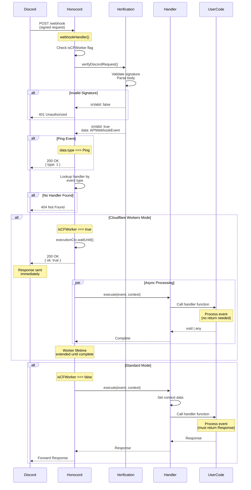

Handles Discord webhook events with type-safe modes for standard and Cloudflare Workers environments.

## Type Parameters

- `T` - Discord webhook event type from `ApplicationWebhookEventType` (inferred from constructor)
- `Env` (default: `{}`) - Environment bindings type, must include `DISCORD_PUBLIC_KEY?: string`
- `Variables` (default: `{}`) - Additional context variables
- `ForWorker` (default: `false`) - Set to `true` for Cloudflare Workers mode (no return type required), `false` for standard mode (must return Response)
- `Data` (default: derived from `T`) - Typed webhook event data payload

## Constructor

```ts
new WebhookEventHandler<T, Env, Variables, ForWorker, Data>(
  eventType: T,
  forWorker?: ForWorker
)
```

**Parameters:**

- `eventType` - The Discord webhook event type to handle (from `ApplicationWebhookEventType`)
- `forWorker` (optional) - Set to `true` for Cloudflare Workers mode, `false` or omit for standard mode

:::note[Type Parameter Order]
The type parameter `T` is typically inferred from the `eventType` constructor argument. If you need to specify custom `Env` or `Variables` types, you must explicitly specify `T` first: `new WebhookEventHandler<typeof ApplicationWebhookEventType.YourEvent, YourEnv, YourVariables>(...)`.
:::

**Examples:**

```ts
import { WebhookEventHandler } from "honocord";
import { ApplicationWebhookEventType } from "discord-api-types/v10";

interface MyEnv {
  DISCORD_PUBLIC_KEY: string;
  DATABASE: D1Database;
}

// Standard mode - handler must return Response
// T is inferred from constructor argument
const standardHandler = new WebhookEventHandler(ApplicationWebhookEventType.EntitlementCreate);

// With custom environment types
const typedHandler = new WebhookEventHandler<
  typeof ApplicationWebhookEventType.EntitlementCreate,
  MyEnv
>(ApplicationWebhookEventType.EntitlementCreate);

// Worker mode - handler can return anything
const workerHandler = new WebhookEventHandler(
  ApplicationWebhookEventType.EntitlementCreate,
  true
);
```

## Methods

### `addHandler(handlerFn)`

Registers the handler function for this webhook event.

**Type Signature:**

```ts
addHandler(
  handlerFn: ForWorker extends true
    ? WebhookEventHandlerFnForWorkers<Data, Env, Variables>
    : WebhookEventHandlerFnWithRequest<Data, Env, Variables>
): void
```

**Parameters:**

- `handlerFn` - The handler function. In standard mode, must return `Response | Promise<Response>`. In worker mode, can return anything (Return value is ignored).

**Examples:**

```ts
// Standard mode
standardHandler.addHandler(async (c) => {
  const data = c.var.data;
  console.log("Received event:", data);
  return c.json({ ok: true }); // ✅ Required
});

// Worker mode
workerHandler.addHandler(async (c) => {
  const data = c.var.data;
  console.log("Received event:", data);
  // No return required ✅
});
```

### `execute(eventData, c)`

Executes the handler with pre-verified event data. This method is called internally by Honocord's `webhookHandler`.

**Type Signature:**

```ts
async execute(
  eventData: Data,
  c: Context<{ Bindings: Env; Variables: BlankVariables & { data: Data } }>
): Promise<Response | any>
```

**Parameters:**

- `eventData` - The pre-verified webhook event data
- `c` - The Hono context

**Returns:** The response from the handler function (or any value in worker mode)

### `fetch` (getter)

Returns the fetch handler for standalone usage. **Only available in standard mode** (`ForWorker = false`).

**Type Signature:**

```ts
get fetch(): ForWorker extends true ? never : typeof this.app.fetch
```

**Throws:** Error if called in worker mode

**Example:**

```ts
const handler = new WebhookEventHandler(
  ApplicationWebhookEventType.EntitlementCreate
  // Standard mode (default)
);

handler.addHandler(async (c) => {
  return c.json({ ok: true });
});

// Use as fetch handler
export default {
  fetch: handler.fetch.bind(handler),
};
```

### `getApp()` (method)

Returns the internal Hono app for standalone usage. **Only available in standard mode** (`ForWorker = false`).

**Type Signature:**

```ts
getApp(): ForWorker extends true ? never : typeof this.app
```

**Throws:** Error if called in worker mode

**Example:**

```ts
import { Hono } from "hono";

const handler = new WebhookEventHandler(ApplicationWebhookEventType.LobbyMessageCreate);

handler.addHandler(async (c) => {
  return c.json({ received: true });
});

// Mount in Hono app
const app = new Hono();
app.route("/discord", handler.getApp());
```

## Properties

### `eventType` (readonly)

The Discord webhook event type this handler responds to.

**Type:** `ApplicationWebhookEventType`

### `handlerType` (readonly)

Always `"webhook"`. Used internally for handler type identification.

**Type:** `"webhook"`

## Usage Patterns

### With Honocord (Recommended)

```ts
import { Honocord, WebhookEventHandler } from "honocord";
import { ApplicationWebhookEventType } from "discord-api-types/v10";

const bot = new Honocord({ isCFWorker: true });

// Worker mode for CF Workers
const handler = new WebhookEventHandler(ApplicationWebhookEventType.EntitlementCreate, true);

handler.addHandler(async (c) => {
  const entitlement = c.var.data;
  // Process entitlement
  // No return needed
});

bot.loadHandlers(handler);

export default bot.getApp(); // /webhook endpoint
```

### Standalone (Standard Mode Only)

```ts
const handler = new WebhookEventHandler(
  ApplicationWebhookEventType.ApplicationAuthorized
);

handler.addHandler(async (c) => {
  const authData = c.var.data;
  console.log(\`App authorized by \${authData.user.username}\`);
  return c.json({ success: true });
});

export default handler.getApp();
```

## See Also

- [Webhook Events Guide](/guides/webhook-events)
- [Discord Webhook Events Documentation](https://docs.discord.com/developers/events/webhook-events)

## Flow Diagram

The following diagram illustrates how webhook events are processed through Honocord:


